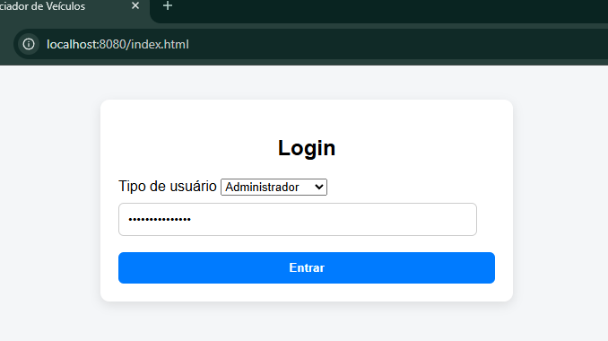
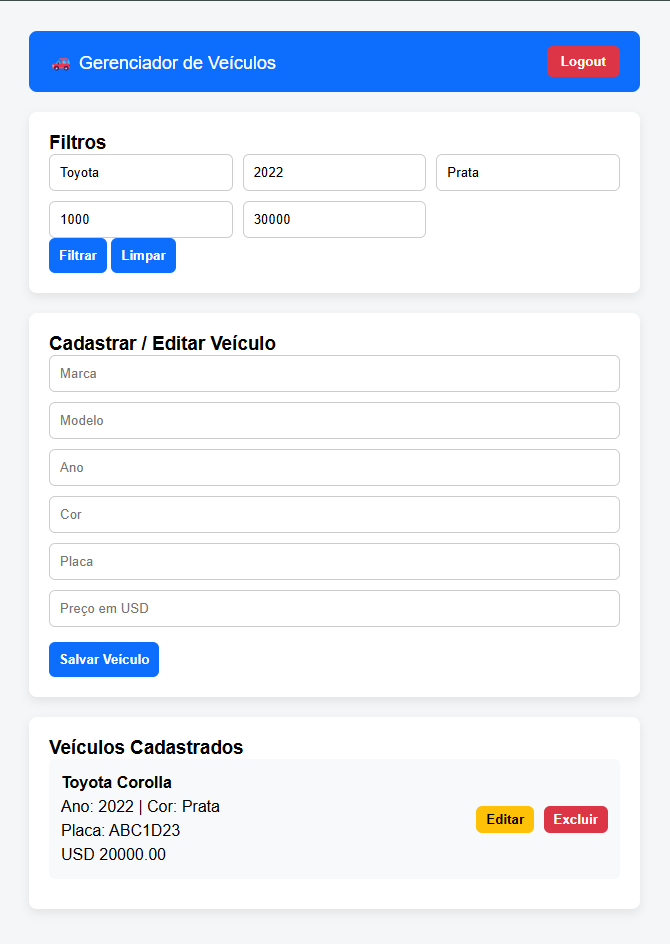

# 🚗 Gerenciador de Veículos

API REST para gerenciamento de veículos, desenvolvida com **Spring Boot 3**, **JWT**, **Spring Security**, **H2** e **Redis (cache)**.

---

## 📌 Tecnologias

- Java 17+
- Spring Boot 3.3.x
- Spring Security + JWT
- Spring Data JPA
- H2 Database (memória)
- Redis (cache)
- Maven
- Swagger / OpenAPI

---

## 📂 Estrutura do Projeto
```
com.tinnova.veiculos
    ├── config
    │ ├── SecurityConfig
    │ └── UserConfig
    ├── controller
    │ ├── AuthController
    │ └── VeiculoController
    ├── model
    │ └── Veiculo
    ├── repository
    │ └── VeiculoRepository
    ├── security
    │ ├── JwtAuthenticationFilter
    │ └── JwtService
    ├── service
    │ ├── VeiculoService
    │ └── CambioService
    └── exception
```

---

## 🔐 Segurança

- Autenticação via **JWT**
- Dois perfis:
    - **ADMIN** → pode criar veículos
    - **USER** → acesso apenas leitura

### Usuários em memória

| Usuário | Senha   | Role  |
|-------|--------|------|
| admin | QRWEWASS!@#@!#4 | ADMIN |
| user  | QRWEWASS!@#@!#4 | USER  |

---

## 🔑 Login

### Endpoint

```
Base url : http://localhost:8080

Headers: 
-Content-Type:application/json
-Authorization:{{Authorization}}

Paths
- POST /auth/login
- POST /veiculos
- GET /veiculos
- GET /veiculos/id
- DELETE /veiculos/id
- GET /veiculos/busca?marca=Toyota&modelo=Corolla&ano=2022&cor=Prata&minPreco=100&maxPreco=400000
```

### Collections do Postam
Importe a collection no postman para facilitar o uso
```
   Está na pasta:
  > resources/postmam/Gerenciador de Veículos API.postman_collection.json
```


Use o token no header:

### Authorization: Bearer <TOKEN>

🚘 Veículos
Criar veículo (ADMIN)
POST http://localhost:8080/veiculos

Authorization: Bearer <TOKEN>
```json
{
  "marca": "Toyota",
  "modelo": "Corolla",
  "ano": 2022,
  "cor": "Preto",
  "placa": "ABC1D23",
  "precoDolar": 20000,
  "vendido": false
}
```

### 📖 Swagger
http://localhost:8080/swagger-ui.html

### 🧪 Testes

```
  mvn test 
```

### ▶️ Executar
``` shell
  mvn spring-boot:run
```
### ▶️ Front end

http://localhost:8080/index.html


### Tela de login


### Home



### 🛠 Observações

Token JWT não expira (ambiente de teste)

Redis usado apenas como cache

Banco H2 em memória


### Desenvolvido por: 
```
ricardo.domingues27@gmail.com
```

